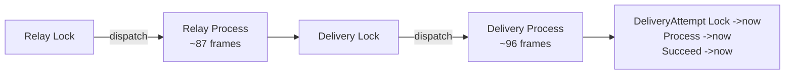

# Root Cause: "Premature end of PHP process" When Faking Triggers

> This document supersedes the mechanism described in `DISPATCHER_FAKE_FINDINGS.md`.
> That document's **evidence** is sound, but its **explanation** (infinite recursion
> in `Dispatcher::record()`) is incorrect. The real cause was isolated empirically
> with stack-depth instrumentation and confirmed by toggling Xdebug.
>
> **August 2026 update:** The `aryeo/actions` vendor package removed the 4 `Run*`
> lifecycle middleware (`RunSucceeded`, `RunFailed`, `RunDispatchAfterSyncSucceeded`,
> `RunDispatchAfterSyncFailed`) that used to wrap every `->now()` hop. That logic
> now lives as plain method calls in `Dispatcher::dispatchNowThroughLifecycle()`
> after the pipeline finishes. The pipeline per hop dropped from 5 middleware to
> just `ThroughLifecycle` (plus optional `WithoutOverlapping`). This roughly halves
> the per-hop frame cost (~20-25 frames vs the old ~40-52), bringing the full sync
> cascade to an estimated ~175-215 frames — well under `xdebug.max_nesting_level =
> 512` even with `Bus::fake()` overhead. **The specific crash described here is
> likely no longer reproducible.** The architectural observations (inconsistent
> async boundaries, sync-test fragility) still apply.

## TL;DR

- The crash is **not** infinite recursion. `Dispatcher::record()` re-entrancy depth
  is only **2**.
- The cascade is **finite**. With Xdebug disabled (`XDEBUG_MODE=off`) the failing
  test **passes** in ~190ms.
- The crash is `xdebug.max_nesting_level = 512` aborting a **deep-but-finite
  synchronous cascade**.
- The depth exists because the test queue runs **synchronously** (`QUEUE_CONNECTION=sync`),
  collapsing what production runs as **3 separate queue jobs** onto a single call stack.
- **This is a test/local artifact, not a production performance problem.** In
  production each queue job peaks at ~110-130 stack frames.
- It does, however, expose a real **architectural inconsistency** in how the state
  machine chain applies async boundaries.

## How This Was Proven

All numbers below were captured by temporarily instrumenting
`Support\Events\Log\Dispatcher\Dispatcher::record()` with `debug_backtrace()`
depth counters and segment-entry probes. All instrumentation has been reverted.

### 1. `record()` does not recurse infinitely

A re-entrancy counter around `record()` peaked at **depth 2**, not 512. The
recursion story in the original findings is ruled out.

### 2. The cascade is finite — Xdebug is the gate

| Run | Result |
| --- | --- |
| `XDEBUG_MODE` default (`develop`) | `Fatal error: Premature end of PHP process` |
| `XDEBUG_MODE=off` | **`OK (1 test, 1 assertion)`** in ~190ms |

> Note: `-d xdebug.mode=off` is **ignored** by Xdebug 3. Only the `XDEBUG_MODE`
> environment variable (or `php.ini`) actually disables it. An earlier attempt with
> `-d` silently kept Xdebug on and briefly pointed the investigation at a
> non-existent logic bug.

### 3. The depth is real and comes from synchronous nesting

Peak PHP call-stack depth measured at `record()` entry:

| Path | Peak depth |
| --- | --- |
| Framework baseline (shallowest `record()`) | 15 |
| Normal / unfaked cascade | **414** |
| With `Bus::fake()` active | **498+** (true peak trips 512 mid-`LogEvent::make()`) |

At peak, **8 state-machine transitions are alive on the stack simultaneously**.
Each `->now()` hop keeps its entire dispatch pipeline on the stack while the child
transition runs.

At the time of measurement, the pipeline per hop was:

```
Trigger->now
  -> Bus\Dispatcher->dispatchNow
    -> Pipeline->then
      -> RunSucceeded / RunFailed / RunDispatchAfterSyncSucceeded / RunDispatchAfterSyncFailed  (4 middleware)
        -> ThroughLifecycle->handle
          -> Trigger->lifecycle
            -> DB::transaction
              -> before() / after()
                -> Event::dispatch
                  -> listener
                    -> next Trigger->now  (repeats)
```

> **Current state:** The 4 `Run*` middleware no longer exist. The pipeline is now
> just `ThroughLifecycle` (+ optional `WithoutOverlapping`), with `succeeded()`/
> `failed()`/dispatch-after logic running as method calls after the pipeline
> completes. Estimated ~20-25 frames per hop now vs ~40-52 at time of measurement.

Measured cost per synchronous hop (at time of measurement):

| Path | Frames per hop | Frames consumed by the 8 nested transitions |
| --- | --- | --- |
| Unfaked | ~32-52 (≈40 avg) | ~292 (**70%** of 414) |
| Faked | ~39-66 (≈52 avg) | ~362 (**73%** of 498) |

**~70% of the total stack depth exists purely because the sub-transitions run
synchronously (`->now()`) instead of crossing a queue boundary.**

### 4. `Bus::fake()` is the amplifier, not the cause

`Bus::fake()` swaps the dispatcher for a `Mockery` mock -> `BusFake` -> real
`Dispatcher` chain, adding ~12 frames per hop (~84 frames total). That is exactly
the amount that tips the already-deep unfaked cascade (414) past Xdebug's 512
ceiling. The fake is the trigger, not the disease.

### 5. Depth does NOT scale with load

Emitting 1, 2, 4, and 8 deliveries all peaked at exactly **414 frames**. Sibling
deliveries are created in a sequential `each()` loop that unwinds between
iterations. **Depth is bounded by chain length (relay -> delivery -> attempt), not
by volume.** This rules out a load-scaling bug.

## Production vs. Test

The chain is deliberately split into **3 independent queue jobs** by two
`->dispatch()` boundaries:



| Environment | Behaviour | Peak stack |
| --- | --- | --- |
| **Production** (real async queue) | Each `dispatch()` returns immediately; stack unwinds; 3 separate jobs | **~110-130 frames per job** (baseline 15 + largest segment 96) |
| **Test** (`QUEUE_CONNECTION=sync`) | Every `dispatch()` runs inline; all 3 jobs collapse onto one stack | **414** |
| **Test + `Bus::fake()`** | Above, plus Mockery/BusFake indirection | **498+** -> trips Xdebug 512 |

> **Current estimate** (after `Run*` middleware removal): unfaked ~175-215, faked
> ~230-270. Both under 512. These are estimates from code structure, not measured.

Segment spans measured from job entry points:

- Framework baseline: **15 frames**
- Relay Process segment: **~87 frames**
- Delivery Process segment: **~96 frames** (deepest single job)

Because there is no Xdebug ceiling in production and each job starts fresh near the
baseline, production is safe and unaffected by throughput.

## The Real Architectural Concern

Not a performance emergency, but two genuine design smells:

1. **Inconsistent async-boundary policy.** Relay and Delivery cross a queue boundary
   at their `Lock -> Process` hop (`->dispatch()`), but **DeliveryAttempt uses
   `->now()`** at the same hop. The design *assumes* async boundaries to stay
   shallow, yet one link in the chain does not honour that. Production absorbs it;
   `sync` tests stack it.

   | Transition | Boundary |
   | --- | --- |
   | Log `Lock` -> `process()` | `->dispatch()` (async) |
   | Relay `Lock` -> `process()` | `->dispatch()` (async) |
   | Delivery `Lock` -> `process()` | `->dispatch()` (async) |
   | DeliveryAttempt `Lock` -> `process()` | `->now()` (**inline — no boundary**) |
   | Delivery `Process` -> `succeed()` | `->now()` (inline) |

2. **The test suite proves the wrong thing.** Running the full cascade under `sync`
   exercises a call-stack shape that never occurs in production, and makes the test
   fragile against a debugging tool (Xdebug). A test asserting "the delivery
   succeeded" should not depend on 400+ synchronous frames.

## Recommended Direction (not workarounds)

1. **Test units at their real boundaries.** Assert each job's outcome and that it
   *dispatches* the next job (`Bus::assertDispatched(...)`) rather than driving the
   entire relay -> attempt chain synchronously in one test. This matches production
   semantics and removes the deep stack entirely.

2. **Make the boundary policy explicit and consistent.** Decide deliberately which
   transitions cross a queue boundary (`->dispatch()`) versus run inline (`->now()`),
   and apply it uniformly across Relay / Delivery / DeliveryAttempt.

3. ~~**(Optional) Harden `Dispatcher::record()` against re-entrancy.** A guard flag so
   `report: true` firing `MessageLogged` cannot feed back through the decorated
   dispatcher. This is defensive hygiene, not the fix for this issue.~~
   **Done.** `Dispatcher::record()` now uses a custom `RecordingFailed` exception
   with its own `report()` method that logs through a raw Logger (no event dispatch),
   breaking the `report → MessageLogged → record()` re-entry loop.

## Reproduction

> **August 2026:** This crash is likely no longer reproducible after the `Run*`
> middleware removal. The commands below are preserved for reference.

```bash
# Fails with the default Xdebug mode (develop):
vendor/bin/phpunit --filter it_succeeds_the_delivery \
  src/Support/Events/Log/Deliveries/Status/Triggers/ProcessTest.php

# Passes with Xdebug disabled — proving the cascade is finite:
XDEBUG_MODE=off vendor/bin/phpunit --filter it_succeeds_the_delivery \
  src/Support/Events/Log/Deliveries/Status/Triggers/ProcessTest.php
```
